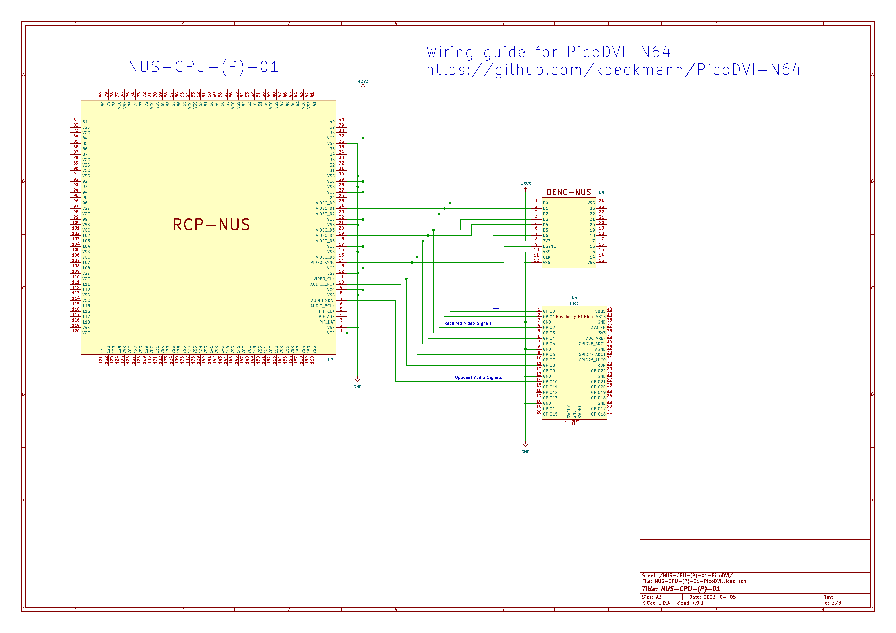
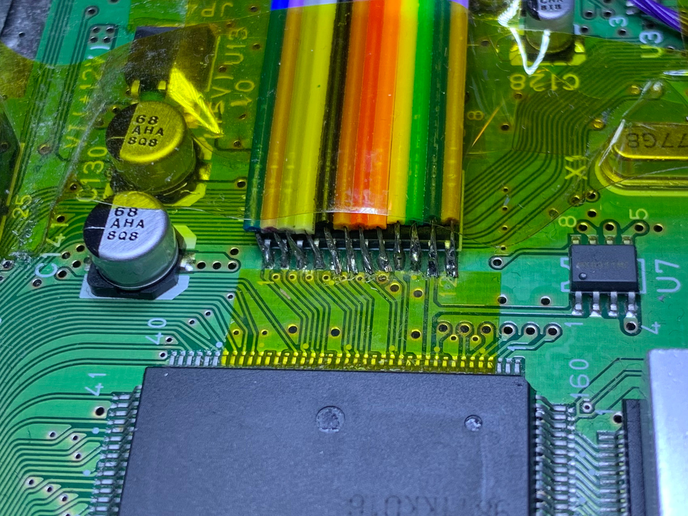

N64 digital video out using PicoDVI


# Hardware

You will need a Raspberry Pi Pico with a DVISock.

The digital video signals need to be wired to the Pico per the wiring diagram below.




# Building

To build the software, first ensure you have a working [Pico SDK](https://github.com/raspberrypi/pico-sdk) setup.

```
cd software
mkdir build
cd build
cmake ..
make n64
```

You should now have a file `apps/n64/n64.uf2` which you can flash the Pico with.

# Pre-built binaries

This repo is using GitHub Actions to build automatically. You can find the binary in the Actions tab. (Actions -> Select the latest build -> Scroll down and download the artifact "PicoDVI-N64" which is a zip file containing the .uf2)

# Credit

https://github.com/Wren6991/PicoDVI

https://github.com/shuichitakano/pico_lib

https://github.com/mlorenzati/PicoDVI.git

